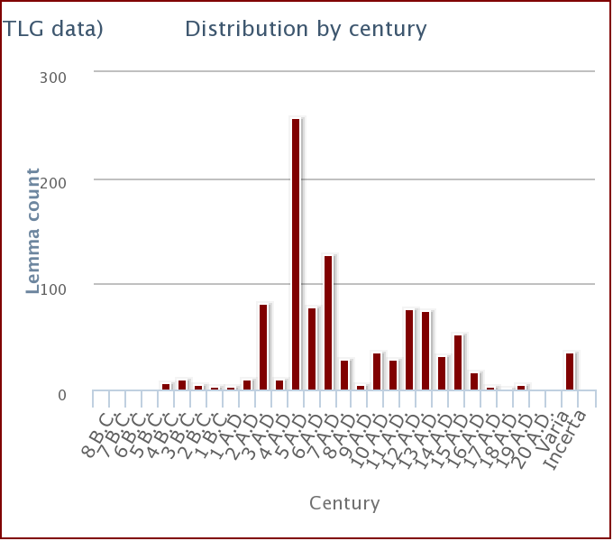

## Lexical Meaning
[TLG Definition](http://stephanus.tlg.uci.edu/lsj/#context=lsj&eid=27284): 
Teaching, instruction

## Gathered Definition from Primary Texts
### Literature & Historiography

### Papyri/Ostraca/Epigraphy/Tablets

## Primary Text References
### In Literature/Historical Writings
**Classical Sources**
- Euripides:
	- Hecuba 601
	- Helena 580
- Demosthenes
**Hellenistic Sources**
- Philodemus:
	- 

**Imperial Sources**
- Philo:
- Plutarch:
- Athenaeus:
- Galen: 

### In Papyri

## Usage Over Time and Geography

Like with [παιδεία](παιδεία.md), the time distribution for this term reveals a sharp increase in the 4th century CE. This is again making me wonder what the cause of this is. Does it reflect some sort of 'looking-back' to an idealised 'education' of the past? Depending on whether the trend continues (i.e., if there's a sharp increase of these terms being in late antiquity), it may be worth looking into the references during this period and seeing what they are referring to and whether it can provide insight into how people in late antiquity perceived education to be in the eras before them. If I do decide to look into this, it seems *City and School in Late Antique Athens and Alexandria* by E. J. Watts may be a good place to start.

--- 
Links: 

Page Status: 

BIS: i~20.21+11.6|F18
%%
Page To-Do:

%%