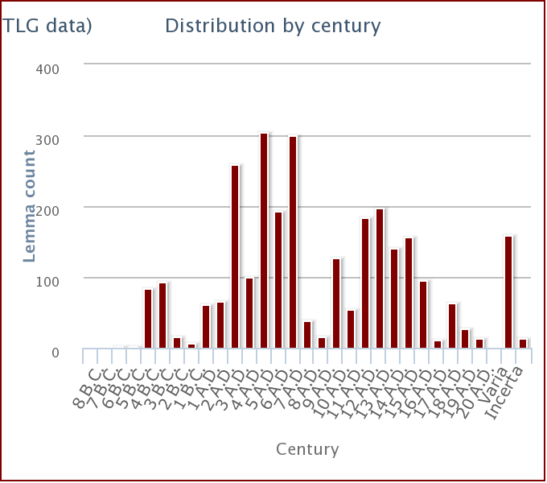

## Lexical Meaning
[TLG](http://stephanus.tlg.uci.edu/lsj/#context=lsj&eid=66642)
1. the act of learning, getting of knowledge
2. desire of learning
3. education, instruction
## Gathered Definition from Primary Texts
### Literature & Historiography

### Papyri/Ostraca/Epigraphy/Tablets

## Primary Text References
### In Literature/Historical Writings

### In Papyri

## Usage Over Time and Geography

Here again, just like with [παιδεία](παιδεία.md) and [δίδαξις](δίδαξις.md), the distribution shows that the term is more prevalent in late antiquity. Perhaps it would be good to look into late antique education just to get a sense of what is going on and why there are so many references to the standard terms for education. 

--- 
Links: 

Page Status: 

BIS: i~20.21+11.6|F18
%%
Page To-Do:

%%